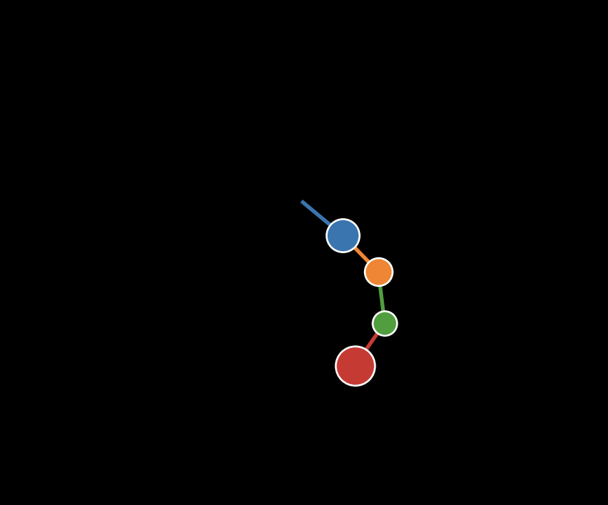
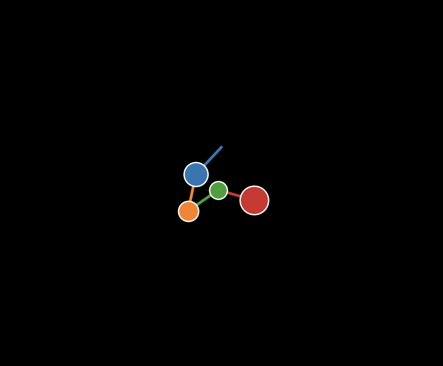
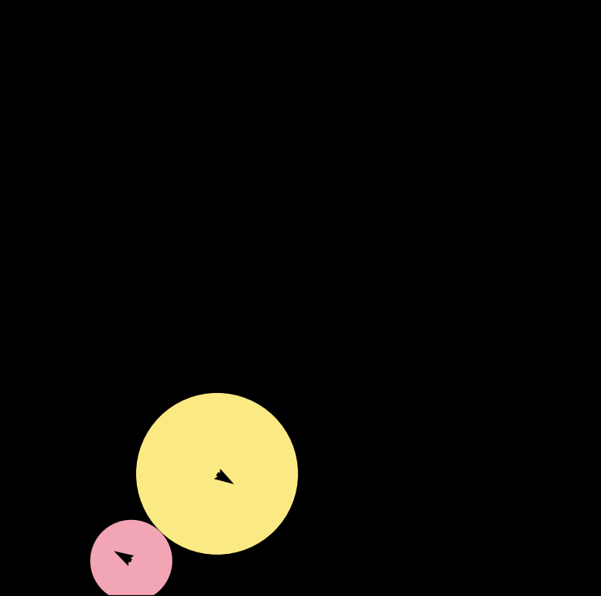
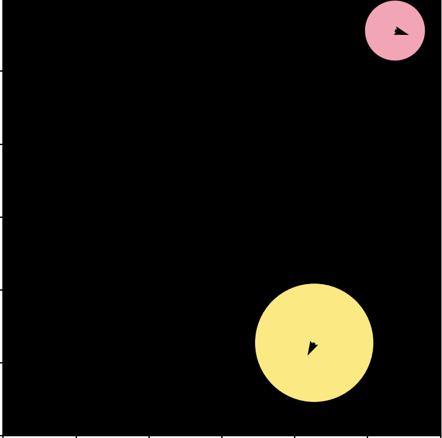

## XPBD Demo

This repo contains XPBD-based simulation of a quadruple pendulum and two bouncing balls enclosed in a box. You can find out more about XPBD (extended position-based dynamics) in this paper: https://matthias-research.github.io/pages/publications/XPBD.pdf

You can run the two demos by first setting up a Python environment with support for numpy and matplotlib. The latter is used to render the simulations real-time.

**Quadruple Pendulum Simulation**: To run, simply type in your terminal `python pendulum.py`. Note, the simulation can be customized by varying the number of links, the length of the links, and the masses.

  
  

**Bouncing Balls in a Box Simulation** To run, simply type in your terminal `python bouncing_ball.py`. Note, the simulation can be customized by varying the sizes of the two balls in the simulation. You can also render the direction of the balls' velocities by setting `self.arrow = True`.

  
  

